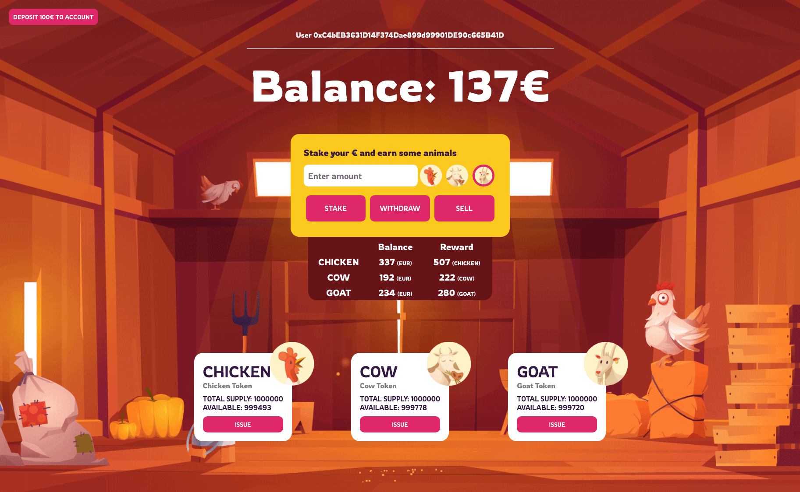

# VU-Blockchain-Task-4-Dapp

  

## Turinys

- [Užduotis](#užduotis)
- [Realizacija](#realizacija)
- [Developement](#developement)
    - [Back end](#back-end)
    - [Contract tests](#contract-tests)
    - [Front end](#front-end)
- [Resources](#resources)

---
## Užduotis

Užduoties tikslas yra sukurti išmaniąją sutartį (angl. smart contract), kuri įgyvendintų tam tikrą verslo logiką ir galėtų užtikrinti jos "saugų" ir "patikimą" funkcionavimą decentralizuotame viešąjame tinkle.

Šioje užduotyje išmanioji sutartis įgyvendinama Solidyti programavimo kalba ir turi būti adaptuota Ethereum blockchain tinklui. Šiai užduočiai atlikti reikės:

- Išmaniosios sutarties kūrimui rekomenduojama naudoti "on-line" įrankį [Remix IDE](https://remix.ethereum.org/), o testavimui ir diegimui [Truffle IDE](http://trufflesuite.com/), kurį reikia įdiegti į savo kompiuterį.
- Decentralizuotos aplikacijos testavimui galite naudoti [Ganache](http://trufflesuite.com/ganache/) įrankį, kuris sukuria lokalų Ethereum tinklą.
- Jums taip pat prireiks kliento [MyEtherWallet](https://www.myetherwallet.com/) arba [MetaMask](https://metamask.io/), kuris įgalins sąsają su Ethereum tinklu.
- Išmaniosios sutarties testavimui naudokite ir vieną iš viešųjų Ethereum testinių tinklų (angl. testnet), pvz., [Ropsten](https://ropsten.etherscan.io/) arba [RinkeBy](https://www.rinkeby.io/#stats).

## Realizacija

Programa realizuota kaip decentralizuota skaitmeninė piniginė, kurioje vartotojas gali _stake_'inti _token_'us ir už tai gauti premiją.

1. Norint pradėti _stake_'inti, pradžioje reikia turėti piniginėje kripto valiutos. Tuo tikslu yra implementuotas mygtukas **DEPOSIT 100€ TO ACCOUNT**, kuris į vartotojo sąskaitą perveda 100€ sumą - šiuo būdu yra simuliuojama situacija, tarsi vartotojas pats savarankiškai persiveda kriptovaliutos į savo piniginę.
2. Vėliau, pasirinkus valiutą, kurią norima _stake_'inti (_chicken_, _cow_ arba _goat_) ir įvedus € sumą, kurią norima deleguoti, galima pradėti _stake_'inti. Paprastumo dėlei yra naudojamas 1:1 konversija - 1 Euras gali nupirkti 1 monetą. Programa iš karto rodo, už kurią valiutą ir kiek jos yra pervesta (_staking balance_ lentelėje).
3. Norint uždirbti premiją už deleguotus eurus, reikia paspausti mygtuką **ISSUE** - tuomet premija, lygi investuotai sumai, yra skiriama vartotojui. Aišku, šį funkcionalumą turėtų valdyti ne pats piniginės vartotojas, o _fermos_ direktorius:) Bet anyways.
4. Investuotus pinigus visuomet galima susigrąžinti naudojant **WITHDRAW** mygtuką - eurai už atitinkamą valiutą yra grąžinami į vartotojo piniginę.
5. Jei vartotojas turi premijų už deleguotus eurus, tai jis gali tą premiją parduoti. Premijų pardavimas irgi vyksta santykiu 1:1 - 1 premijos taškas yra lygus 1 Eurui.

Na va, tokiu būdu galima ir praturtėti. Tingiu daugiau rašyti.

  

---
## Developement

### Back end

1. Make sure you have [truffle](https://www.trufflesuite.com/) installed.
2. Install and run [Ganache](https://www.trufflesuite.com/ganache) to run Ethereum network.
3. Compile contracts: `truffle compile`
4. Migrate contracts:
    - First time: `truffle migrate`
    - Other times: `truffle migrate --reset`
5. To test contracts in CLI, start truffle console: `truffle console`.

---

### Contract tests

1. Run `truffle test` to execute contract tests.

---

### Front end

1. Install and run [Ganache](https://www.trufflesuite.com/ganache) to run Ethereum network.
2. Install and run [MetaMask](https://metamask.io/) on your browser.
3. In MetaMask, select Ganache network. If it does not exist, `Add Network`:
    - Network Name: Ganache
    - New RPC URL: `HTTP://127.0.0.1:7545` (should be the same as displayed in the Ganache app RPC Server section, Port should match to `truffle-config.js` port)
    - Chain ID: 1337
4. In MetaMask, import new account:
    - In Ganache select the second address and click on the KEY icon on the right. Copy the Private Key.
    - In MetaMask, `Import New Account` and paste the private key from step 1.
5. Change directory: `cd client`
6. Run: `npm run start`.

---

## Resources

- [Truffle React](https://www.trufflesuite.com/boxes/react)
- [Blockchain Tutorial for Beginners](https://www.youtube.com/watch?v=CgXQC4dbGUE)
- [5 minute guide to deploying smart contracts with Truffle and Ropsten](https://medium.com/coinmonks/5-minute-guide-to-deploying-smart-contracts-with-truffle-and-ropsten-b3e30d5ee1e)